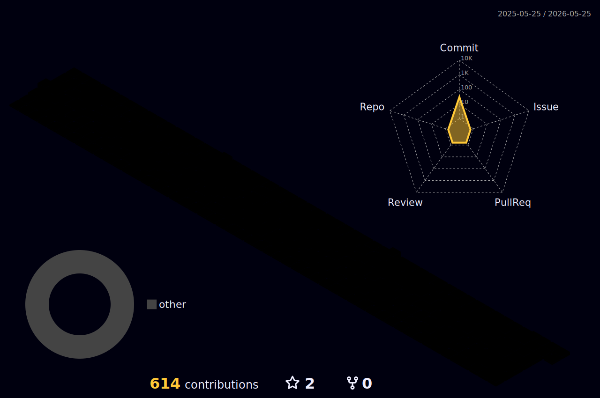

<h1 align="center">Hi, I'm Faisal 👋</h1>

  

  <b>I love to build systems that turn ideas into working products.</b>

  Full-stack developer • AI agents • DevOps • Product engineering

  
  

---

## 🚀 About Me

I’m a developer who enjoys building practical, production-ready systems — from full-stack web apps to AI workflows, backend APIs, infrastructure, automations, and analytics dashboards.

I like working close to real-world problems: shipping features, debugging production issues, improving reliability, and turning rough ideas into usable products.

- 🔭 Currently building products around **AI calling, automation, and workflow intelligence**
- 🧠 Interested in **AI agents, voice infra, backend architecture, DevOps, and product systems**
- ⚙️ I enjoy working across the stack: frontend, backend, databases, queues, deployments, and monitoring
- 🌱 Always improving how I design, ship, and scale systems
- 💬 Ask me about **Next.js, FastAPI, Postgres, Docker, Redis, AI agents, and production debugging**

---

## 🛠️ Tech Stack

  

### Tools & Platforms I Work With

  
  
  
  
  
  
  
  

---

## ⚡ What I Like Building

<pre>
Backend APIs             ████████████████████
Full-stack products      ███████████████████
DevOps & deployments     ██████████████████
Data & analytics         ████████████████
Automation systems       █████████████████
AI workflows             ██████████████████
</pre>

---

## 🧩 Contribution Graph

  

---

## 📊 GitHub Stats

  

  

  
  

---

## 🧠 Currently Exploring

- Better AI agent workflows
- Real-time voice infrastructure
- Scalable backend systems
- Product automation
- Cleaner DevOps and deployment pipelines
- Better analytics and reporting systems

---

## 🤝 Connect With Me

  
  

---

  <b>Building, breaking, debugging, shipping — one system at a time.</b>

